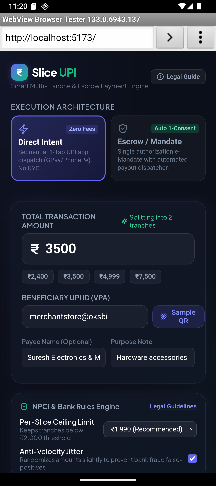
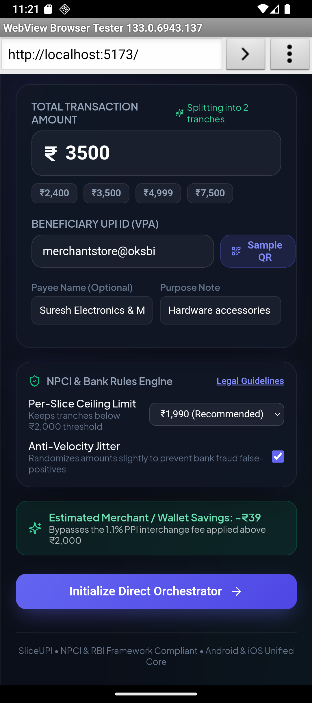
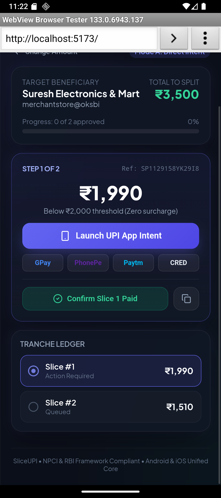
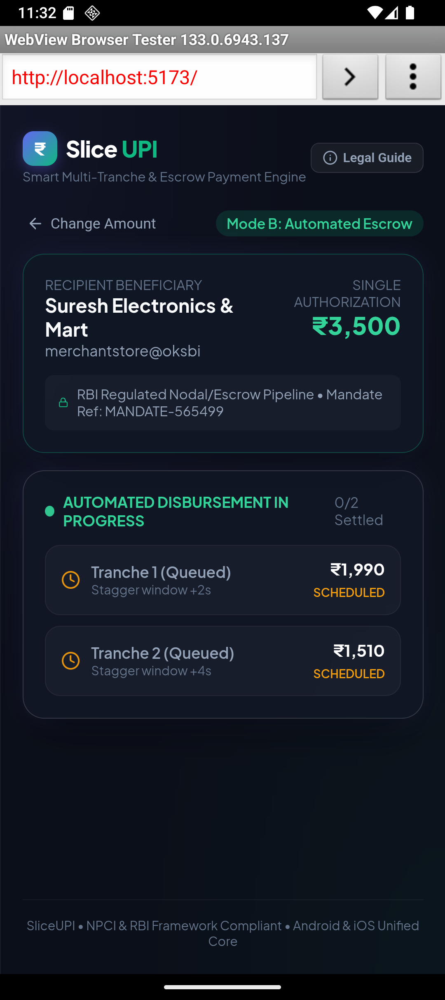
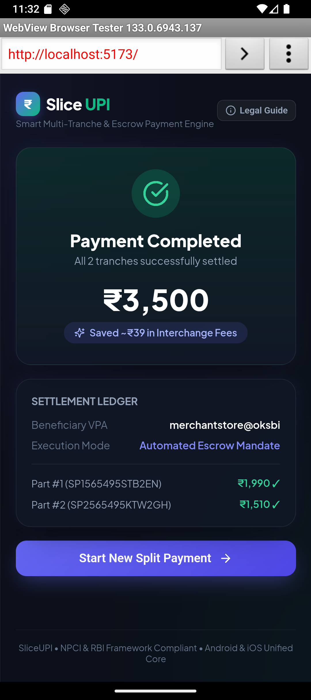

# SliceUPI &bull; Smart Multi-Tranche & Escrow Payment Engine

[](#)
[](#)
[](#)

A cross-platform UPI payment orchestrator designed to optimize high-value transactions (> ₹2,000) under **NPCI** and **RBI** regulatory guidelines using two user-selectable architectural models.

---

## 📱 Running in Android Emulator

The app has been verified running on the **Pixel 9** Android Emulator with full support for deep links, AutoPay mandate simulation, and receipt generation.

| 1. Home & Configuration | 2. Slicing & Rules Engine | 3. Mode A: Intent Runner |
| :---: | :---: | :---: |
|  |  |  |

| 4. Mode B: Escrow Dispersal | 5. Settlement Receipt |
| :---: | :---: |
|  |  |

For complete emulator setup and debugging commands, see the [Android Emulator Execution Guide](docs/EMULATOR_GUIDE.md).

---

## 💡 Why High-Value Splits (> ₹2,000) Matter

1. **Prepaid Payment Instrument (PPI) Wallet Interchange:**
   - NPCI imposes an interchange fee of up to **1.1%** for merchant transactions exceeding ₹2,000 made through prepaid wallets (e.g. Paytm Wallet, PhonePe Wallet). Direct bank-to-bank UPI transfers have **0% MDR**.
2. **Cooling Limits on New Beneficiaries:**
   - Indian banks enforce 24-hour velocity and transfer caps (typically ₹2,000–₹5,000) when paying unverified or newly added VPAs.
3. **PMLA Anti-Structuring Compliance:**
   - Dividing payments into identical round-number tranches trips banking Anti-Money Laundering (AML) monitoring. SliceUPI features **Anti-Velocity Jitter** to vary slice amounts (e.g., ₹1,985 + ₹1,515 instead of two ₹1,750 slices).

---

## ⚡ Execution Modes

### Mode A: Direct Intent Orchestrator (Zero Surcharge, Client-Side)
- **Zero Intermediary Fees:** Splits amounts into sub-₹2,000 slices settled directly bank-to-bank.
- **Native App Intents:** Dispatches native `upi://pay` deep links directly to installed payment apps (**Google Pay, PhonePe, Paytm, BHIM, CRED**).
- **NPCI Common Library Compliance:** Users authenticate each slice individually via their bank's UPI MPIN screen.

### Mode B: Automated Escrow / Gateway AutoPay (1-Click Mandate)
- **1-Click User Experience:** User grants **one single authorization** for the total amount via UPI AutoPay.
- **Automated Payout Pipeline:** An RBI-regulated nodal/escrow backend automatically staggers and disburses the individual sub-₹2,000 tranches directly to the payee VPA without requiring repeated MPIN inputs.

For in-depth mathematical models and regulatory references, see the [Architecture & Technical Specification](docs/ARCHITECTURE.md).

---

## 🛠️ Project Structure

```text
upi-split-app/
├── docs/
│   ├── ARCHITECTURE.md          # Full technical architecture & regulatory spec
│   ├── EMULATOR_GUIDE.md        # Step-by-step Android emulator & adb guide
│   └── images/                  # High-res verified emulator screenshots
├── src/
│   ├── components/
│   │   ├── ComplianceModal.tsx  # NPCI & RBI regulatory guidance modal
│   │   ├── EscrowRunner.tsx     # Mode B: 1-Click mandate & automated dispersal
│   │   ├── IntentRunner.tsx     # Mode A: Sequential slice launcher & app selectors
│   │   ├── ModeSelector.tsx     # Architecture toggle (Mode A vs Mode B)
│   │   ├── SplitCalculator.tsx  # Dynamic amount calculator, jitter & QR generator
│   │   └── SummaryReceipt.tsx   # Transaction completion receipt & breakdown
│   ├── services/
│   │   └── upiService.ts        # URI generator, app schemes, and slice algorithm
│   ├── types/
│   │   └── index.ts             # TypeScript domain interfaces
│   ├── App.tsx                  # Main orchestration container
│   ├── index.css                # Dark-mode glassmorphic styling system
│   └── main.tsx                 # React entrypoint
├── package.json
└── vite.config.ts
```

---

## 🚀 Quick Start Guide

### 1. Installation
```powershell
# Clone or navigate to the repository
cd D:\Antigravity\upi-split-app

# Install dependencies
npm install
```

### 2. Development Server
```powershell
# Run with host binding for network & emulator access
npm run dev -- --host 0.0.0.0 --port 5173
```
- **Local Browser:** `http://localhost:5173`
- **Android Emulator:** `http://10.0.2.2:5173` (or `http://localhost:5173` with `adb reverse tcp:5173 tcp:5173`)

### 3. Build & Type Check
```powershell
npm run build
```

---

## 📱 Native App Packaging (Capacitor / React Native)

Wrap the web core into native Android and iOS apps using Capacitor:

```powershell
# 1. Install Capacitor
npm install @capacitor/core @capacitor/android
npm install -D @capacitor/cli

# 2. Initialize
npx cap init "SliceUPI" "com.sliceupi.app" --web-dir dist

# 3. Add Android platform & sync
npm run build
npx cap add android
npx cap sync

# 4. Open in Android Studio
npx cap open android
```

---

## 📚 Documentation Index

- 📘 [System Architecture & Regulatory Specification](docs/ARCHITECTURE.md)
- 📗 [Android Emulator & Device Execution Guide](docs/EMULATOR_GUIDE.md)