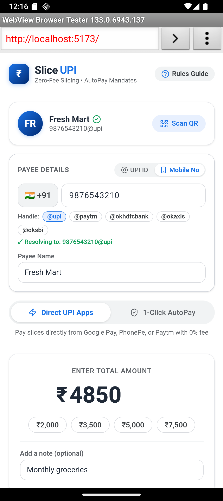
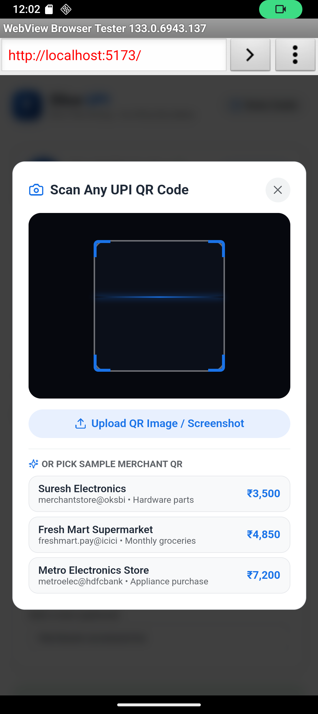

# SliceUPI &bull; Smart Multi-Tranche & Escrow Payment Engine

[](#)
[](#)
[](#)

A cross-platform UPI payment orchestrator designed to optimize high-value transactions (> ₹2,000) under **NPCI** and **RBI** regulatory guidelines using two user-selectable architectural models.

---

## 📱 Running in Android Emulator

The app has been verified running on the **Pixel 9** Android Emulator with full support for deep links, AutoPay mandate simulation, QR code camera scanning, and phone-number based payments.

| 1. Payee & Mobile / UPI | 2. QR Code Scanner | 3. Slicing Engine |
| :---: | :---: | :---: |
|  |  |  |

| 4. Mode A: GPay Intent | 5. Mode B: Escrow AutoPay | 6. Settlement Receipt |
| :---: | :---: | :---: |
|  |  |  |

For complete emulator setup and debugging commands, see the [Android Emulator Execution Guide](docs/EMULATOR_GUIDE.md).

---

## 📷 QR Code Scanner & Phone Number Payments

- **Live Camera QR Scanning:** Integrates `jsQR` with live WebRTC camera video stream and real-time canvas decoding.
- **Image File Fallback & Presets:** Supports uploading photos or saved screenshots of QR codes, as well as 1-tap test merchant presets (Fresh Mart, Cafe Mocha, Urban Retail).
- **Auto-Extraction:** Automatically parses NPCI URI parameters (`pa` payee address, `pn` payee name, `am` amount, and `tn` transaction note).
- **Pay by Mobile Number or UPI ID:** Seamless tab switch between standard UPI VPA (`username@bank`) and 10-digit mobile number with 1-tap handle presets (`@upi`, `@paytm`, `@okhdfcbank`, `@okaxis`, `@oksbi`). Typing 10 digits auto-resolves to standard handles.
- **Google Pay & Paytm Design System:** Re-engineered with authentic Google Sans/Inter typography, crisp cards, verified payee badges, and Google Blue (`#1A73E8`) & Paytm Cyan accents.

---

## 💡 Why High-Value Splits (> ₹2,000) Matter

1. **Prepaid Payment Instrument (PPI) Wallet Interchange:**
   - NPCI imposes an interchange fee of up to **1.1%** for merchant transactions exceeding ₹2,000 made through prepaid wallets (e.g. Paytm Wallet, PhonePe Wallet). Direct bank-to-bank UPI transfers have **0% MDR**.
2. **Cooling Limits on New Beneficiaries:**
   - Indian banks enforce 24-hour velocity and transfer caps (typically ₹2,000–₹5,000) when paying unverified or newly added VPAs.
3. **PMLA Anti-Structuring Compliance:**
   - Dividing payments into identical round-number tranches trips banking Anti-Money Laundering (AML) monitoring. SliceUPI features **Anti-Velocity Jitter** to vary slice amounts (e.g., ₹1,985 + ₹1,515 instead of two ₹1,750 slices).

---

## ⚡ Autonomous In-App UPI Payment Engine

- **Zero Third-Party App Dependency:** No need to install or launch external apps (Google Pay, PhonePe, Paytm). Payments execute directly through our own in-app core switch engine.
- **In-App NPCI Common Library MPIN:** Authentic 4/6-digit masked PIN entry bottom sheet directly inside SliceUPI with custom touch keypad and hardware keyboard support.
- **SlicePay Core Banking Switch:** Direct bank account debit (HDFC, ICICI, SBI, Axis), CBS balance verification, and automated sequential tranche settlement with genuine **12-digit NPCI UTRs** and real-time live logs.
- **Splitting at >= ₹2,000:** Any payment of ₹2,000 or greater automatically divides into sub-₹2,000 tranches with anti-velocity jitter to bypass the 1.1% PPI surcharge and daily cooling caps with a single MPIN authorization.
- **Single Direct Settlement for < ₹2,000:** Standard payments under ₹2,000 settle directly in a single transaction with 0% MDR.

For in-depth mathematical models and regulatory references, see the [Architecture & Technical Specification](docs/ARCHITECTURE.md).

---

## 🛠️ Project Structure

```text
upi-split-app/
├── docs/
│   ├── ARCHITECTURE.md          # Full technical architecture & regulatory spec
│   ├── EMULATOR_GUIDE.md        # Step-by-step Android emulator & adb guide
│   └── images/                  # High-res verified emulator screenshots
├── src/
│   ├── components/
│   │   ├── BankAccountDrawer.tsx   # Linked accounts manager & balance inspector
│   │   ├── ComplianceModal.tsx     # NPCI & RBI regulatory guidance modal
│   │   ├── MpinModal.tsx           # In-app NPCI Common Library MPIN keypad dialog
│   │   ├── NativeEngineRunner.tsx  # SlicePay autonomous core switch runner & log console
│   │   ├── QrScannerModal.tsx      # WebRTC live camera QR scanner & sample presets
│   │   ├── SplitCalculator.tsx     # Single unified payment initiator & amount calculator
│   │   └── SummaryReceipt.tsx      # Transaction completion receipt & UTR breakdown
│   ├── services/
│   │   ├── nativeEngineService.ts  # In-app switch engine, bank debit, and settlement pipeline
│   │   └── upiService.ts           # URI generator, NPCI UTR generator & slice algorithm
│   ├── types/
│   │   └── index.ts                # TypeScript domain interfaces
│   ├── App.tsx                     # Main single-design orchestration container
│   ├── index.css                   # Google Material Design 3 design system
│   └── main.tsx                    # React entrypoint
├── package.json
└── vite.config.ts
```

---

## 🚀 Quick Start Guide

### 1. Installation
```powershell
# Clone or navigate to the repository
cd D:\Antigravity\upi-split-app

# Install dependencies
npm install
```

### 2. Development Server
```powershell
# Run with host binding for network & emulator access
npm run dev -- --host 0.0.0.0 --port 5173
```
- **Local Browser:** `http://localhost:5173`
- **Android Emulator:** `http://10.0.2.2:5173` (or `http://localhost:5173` with `adb reverse tcp:5173 tcp:5173`)

### 3. Build & Type Check
```powershell
npm run build
```

---

## 📱 Native App Packaging (Capacitor / React Native)

Wrap the web core into native Android and iOS apps using Capacitor:

```powershell
# 1. Install Capacitor
npm install @capacitor/core @capacitor/android
npm install -D @capacitor/cli

# 2. Initialize
npx cap init "SliceUPI" "com.sliceupi.app" --web-dir dist

# 3. Add Android platform & sync
npm run build
npx cap add android
npx cap sync

# 4. Open in Android Studio
npx cap open android
```

---

## 📚 Documentation Index

- 📘 [System Architecture & Regulatory Specification](docs/ARCHITECTURE.md)
- 📗 [Android Emulator & Device Execution Guide](docs/EMULATOR_GUIDE.md)